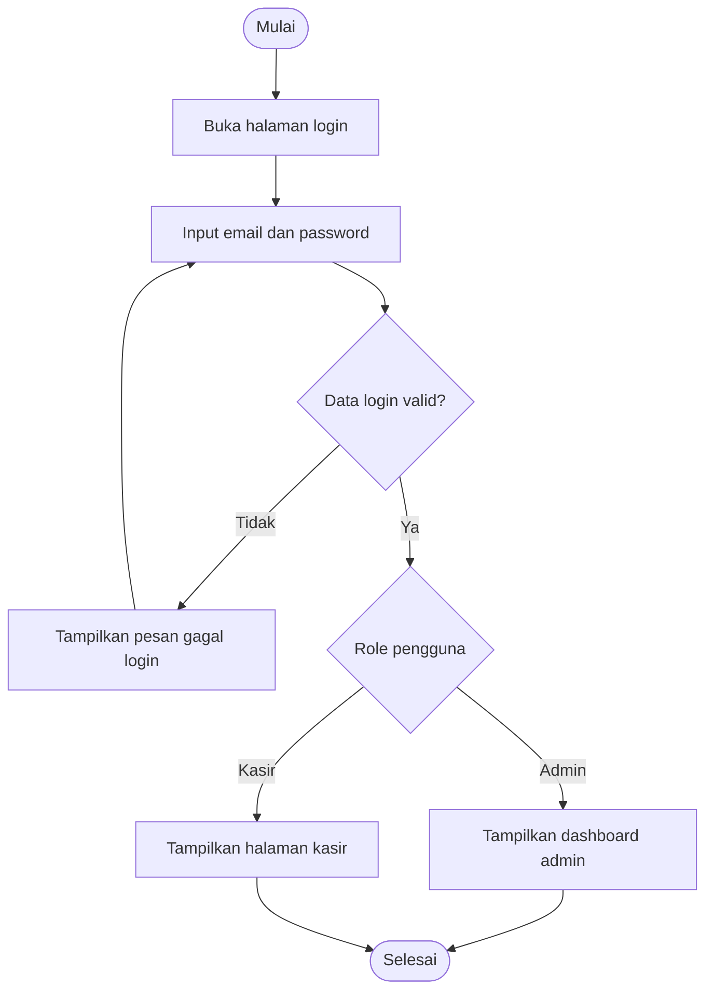
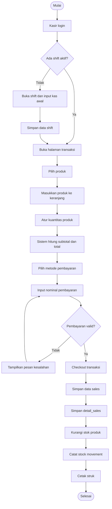
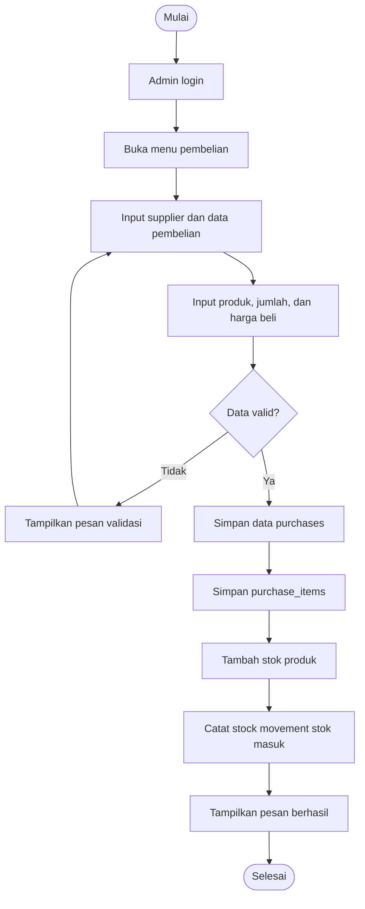
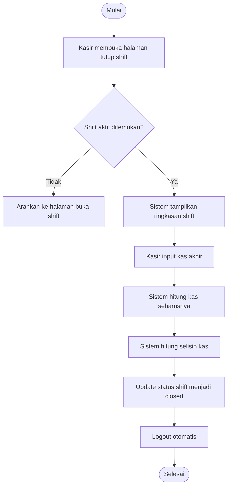
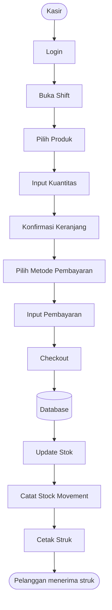
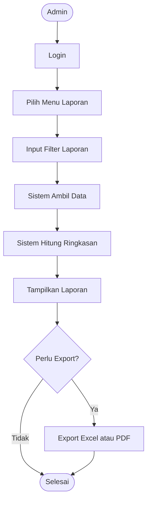
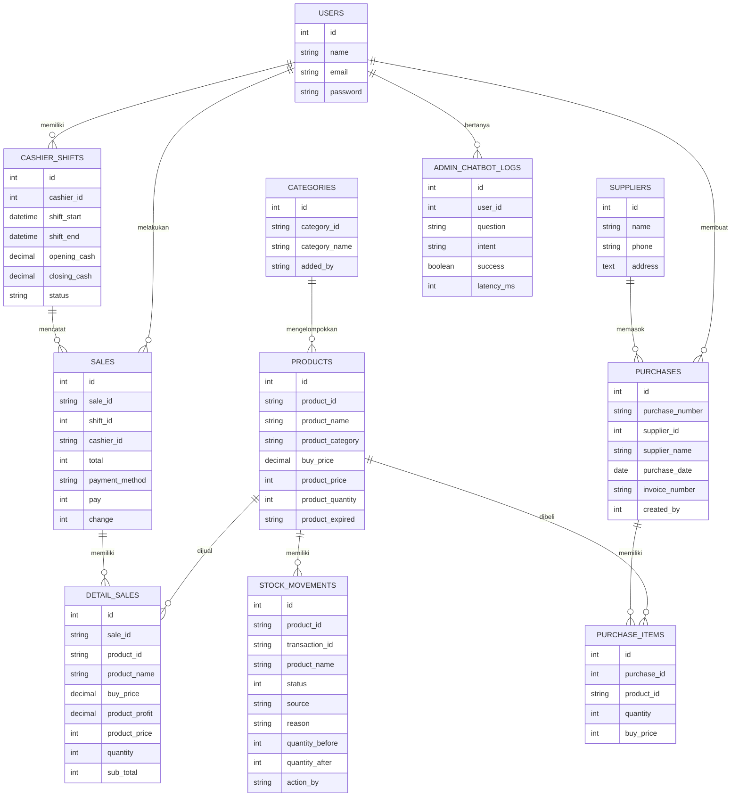

# Penjelasan Sistem Point of Sale (POS) Berbasis Web

## 1. Gambaran Umum Sistem

Sistem yang dikembangkan merupakan aplikasi **Point of Sale (POS) berbasis web** menggunakan framework Laravel. Sistem ini dirancang untuk membantu proses operasional penjualan pada toko, mulai dari pengelolaan data produk, kategori, supplier, pembelian stok, transaksi kasir, pencatatan pergerakan stok, pengelolaan shift kasir, hingga penyusunan laporan penjualan dan laba.

Aplikasi ini memiliki dua jenis pengguna utama, yaitu **Admin** dan **Kasir**. Admin berperan sebagai pengelola data master dan pemantau laporan, sedangkan Kasir berperan sebagai pengguna operasional yang melakukan transaksi penjualan langsung kepada pelanggan.

Secara umum, sistem ini bertujuan untuk:

1. Mempermudah pencatatan data produk dan kategori.
2. Mempermudah proses transaksi penjualan oleh kasir.
3. Mengurangi risiko kesalahan pencatatan stok barang.
4. Menyediakan laporan penjualan, laba, dan shift kasir.
5. Menyediakan histori pergerakan stok agar aktivitas stok dapat ditelusuri.
6. Membantu admin mendapatkan ringkasan data melalui chatbot internal berbasis query database.

## 2. Teknologi yang Digunakan

Sistem POS ini dibangun dengan beberapa teknologi utama, yaitu:

| Komponen | Teknologi |
|---|---|
| Bahasa Pemrograman | PHP |
| Framework Backend | Laravel 11 |
| Frontend Interaktif | Livewire 3 |
| Database | MySQL |
| Role dan Permission | Spatie Laravel Permission |
| Asset Bundler | Vite |
| Tampilan UI | Blade Template, Bootstrap, NiceAdmin |

Laravel digunakan sebagai kerangka kerja utama untuk mengatur route, controller, model, migration, autentikasi, dan validasi. Livewire digunakan terutama pada halaman transaksi kasir agar proses tambah produk ke keranjang, ubah kuantitas, dan checkout dapat berjalan lebih interaktif tanpa harus membuat halaman baru secara manual.

## 3. Aktor Sistem

Aktor adalah pihak yang berinteraksi langsung dengan sistem. Pada sistem ini terdapat tiga aktor utama.

| Aktor | Keterangan |
|---|---|
| Admin | Pengguna yang memiliki akses untuk mengelola data master, user kasir, supplier, pembelian, laporan, stock movement, shift kasir, dan chatbot admin. |
| Kasir | Pengguna yang melakukan transaksi penjualan, membuka shift, menutup shift, melihat produk, mencetak struk, dan mengelola profil pribadi. |
| Pelanggan | Pihak eksternal yang membeli barang. Pelanggan tidak login ke sistem, tetapi terlibat dalam proses transaksi melalui kasir. |

## 4. Modul Sistem

### 4.1 Modul Autentikasi dan Hak Akses

Modul autentikasi digunakan untuk memastikan hanya pengguna terdaftar yang dapat masuk ke sistem. Sistem membedakan akses berdasarkan role, yaitu **admin** dan **cashier**. Setelah login, sistem akan mengarahkan pengguna sesuai hak aksesnya.

Admin hanya dapat membuka halaman admin, sedangkan kasir hanya dapat membuka halaman kasir. Pembatasan akses ini dilakukan menggunakan middleware autentikasi, verifikasi email, dan role.

### 4.2 Modul Admin

Modul admin berfungsi untuk mengelola data dan memantau operasional toko. Fitur yang tersedia pada modul admin meliputi:

1. Dashboard admin.
2. Pengelolaan produk.
3. Pengelolaan kategori.
4. Pengelolaan supplier.
5. Pengelolaan pembelian stok.
6. Pengelolaan user kasir.
7. Melihat data penjualan.
8. Melihat detail transaksi penjualan.
9. Melihat stock movement.
10. Melihat laporan laba.
11. Melihat laporan shift kasir.
12. Menggunakan chatbot admin.
13. Mengelola profil dan password admin.

### 4.3 Modul Kasir

Modul kasir digunakan untuk kegiatan transaksi penjualan. Fitur utama pada modul kasir meliputi:

1. Membuka shift kasir.
2. Melihat daftar produk.
3. Melakukan transaksi penjualan.
4. Menambahkan produk ke keranjang transaksi.
5. Mengubah kuantitas produk dalam transaksi.
6. Memilih metode pembayaran.
7. Menghitung total pembayaran dan kembalian.
8. Checkout transaksi.
9. Mencetak struk transaksi.
10. Menutup shift kasir.
11. Mengelola profil dan password kasir.

### 4.4 Modul Produk dan Kategori

Modul produk digunakan untuk menyimpan data barang yang dijual. Setiap produk memiliki kode produk, nama produk, kategori, gambar, harga jual, harga beli, keuntungan, jumlah stok, dan tanggal kedaluwarsa. Produk dikelompokkan berdasarkan kategori agar admin dan kasir lebih mudah mencari barang.

Setiap penambahan, pengubahan, atau penghapusan produk dapat memengaruhi data stok dan dicatat pada tabel pergerakan stok.

### 4.5 Modul Supplier dan Pembelian

Modul supplier digunakan untuk menyimpan data pemasok barang. Modul pembelian digunakan oleh admin untuk mencatat pembelian barang dari supplier. Saat pembelian disimpan, sistem menambahkan stok produk sesuai jumlah barang yang dibeli dan mencatat aktivitas tersebut sebagai stock movement.

Dengan adanya modul ini, stok barang tidak hanya berubah karena transaksi penjualan, tetapi juga karena aktivitas pembelian barang masuk.

### 4.6 Modul Transaksi Penjualan

Modul transaksi penjualan digunakan oleh kasir untuk melayani pembelian pelanggan. Kasir memilih produk, memasukkan jumlah barang, memilih metode pembayaran, lalu melakukan checkout. Setelah checkout berhasil, sistem menyimpan data ke tabel penjualan dan detail penjualan, mengurangi stok produk, mencatat stock movement, dan menyediakan struk untuk dicetak.

Metode pembayaran yang didukung pada sistem adalah:

1. Cash.
2. Transfer.
3. QRIS.

### 4.7 Modul Shift Kasir

Modul shift kasir digunakan untuk mencatat waktu kerja kasir. Sebelum melakukan transaksi, kasir harus membuka shift dengan memasukkan kas awal. Setelah selesai bekerja, kasir menutup shift dengan memasukkan kas akhir. Sistem kemudian menghitung ringkasan transaksi dan selisih kas.

Modul ini berguna untuk memantau transaksi berdasarkan sesi kerja kasir, sehingga admin dapat melakukan evaluasi terhadap kinerja kasir dan kesesuaian uang kas.

### 4.8 Modul Laporan

Sistem menyediakan beberapa laporan, antara lain:

1. Laporan penjualan.
2. Detail transaksi penjualan.
3. Laporan laba.
4. Laporan stock movement.
5. Laporan shift kasir.
6. Export laporan ke Excel atau PDF pada fitur tertentu.

Laporan ini membantu admin dalam melakukan pengambilan keputusan, seperti mengetahui produk terlaris, total omzet, laba, stok masuk, stok keluar, serta performa kasir.

### 4.9 Modul Chatbot Admin

Chatbot admin merupakan fitur bantuan untuk admin dalam membaca data dari database. Chatbot ini bersifat **read-only**, artinya hanya digunakan untuk menampilkan informasi dan tidak digunakan untuk mengubah data. Pertanyaan admin diproses oleh intent parser internal, kemudian sistem mengambil data yang sesuai dari database.

Contoh pertanyaan yang dapat ditangani chatbot:

1. Cek stok produk tertentu.
2. Menampilkan produk dengan stok menipis.
3. Menampilkan produk terlaris bulan ini.
4. Menampilkan ringkasan penjualan mingguan atau bulanan.
5. Menampilkan produk yang akan kedaluwarsa.
6. Menampilkan penjualan per kasir.
7. Menampilkan stok masuk dan stok keluar.

## 5. Alur Kerja Sistem

### 5.1 Alur Login Pengguna

1. Pengguna membuka halaman login.
2. Pengguna memasukkan email dan password.
3. Sistem memvalidasi data login.
4. Jika login gagal, sistem menampilkan pesan kesalahan.
5. Jika login berhasil, sistem memeriksa role pengguna.
6. Jika pengguna adalah admin, sistem menampilkan dashboard admin.
7. Jika pengguna adalah kasir, sistem mengarahkan ke halaman kasir.

### 5.2 Alur Admin Mengelola Produk

1. Admin login ke sistem.
2. Admin membuka menu produk.
3. Admin memilih aksi tambah, edit, atau hapus produk.
4. Sistem menampilkan form sesuai aksi yang dipilih.
5. Admin mengisi atau mengubah data produk.
6. Sistem melakukan validasi input.
7. Jika validasi gagal, sistem menampilkan pesan kesalahan.
8. Jika validasi berhasil, sistem menyimpan perubahan data produk.
9. Sistem mencatat perubahan stok pada stock movement apabila terdapat perubahan terkait stok.
10. Sistem menampilkan pesan berhasil.

### 5.3 Alur Admin Mencatat Pembelian Stok

1. Admin login ke sistem.
2. Admin membuka menu pembelian.
3. Admin memilih supplier atau mengisi nama supplier.
4. Admin memasukkan tanggal pembelian, nomor invoice, dan daftar produk yang dibeli.
5. Admin memasukkan kuantitas dan harga beli setiap produk.
6. Sistem memvalidasi data pembelian.
7. Sistem menyimpan data pembelian ke tabel pembelian.
8. Sistem menyimpan rincian pembelian ke tabel item pembelian.
9. Sistem menambah stok produk sesuai jumlah pembelian.
10. Sistem mencatat stok masuk pada stock movement.
11. Sistem menampilkan pesan pembelian berhasil disimpan.

### 5.4 Alur Kasir Melakukan Transaksi Penjualan

1. Kasir login ke sistem.
2. Kasir membuka shift dengan memasukkan kas awal.
3. Sistem mencatat data shift aktif.
4. Kasir membuka halaman transaksi penjualan.
5. Kasir memilih produk yang dibeli pelanggan.
6. Sistem memasukkan produk ke keranjang transaksi.
7. Kasir mengatur jumlah produk.
8. Sistem menghitung subtotal dan total transaksi.
9. Kasir memilih metode pembayaran.
10. Kasir memasukkan nominal pembayaran jika metode pembayaran cash.
11. Sistem menghitung kembalian.
12. Kasir melakukan checkout.
13. Sistem menyimpan data transaksi ke tabel sales.
14. Sistem menyimpan detail produk ke tabel detail_sales.
15. Sistem mengurangi stok produk.
16. Sistem mencatat stok keluar pada stock movement.
17. Sistem menampilkan atau mencetak struk transaksi.
18. Setelah selesai bekerja, kasir menutup shift.

### 5.5 Alur Admin Melihat Laporan

1. Admin login ke sistem.
2. Admin memilih menu laporan, misalnya laporan penjualan, laporan laba, stock movement, atau laporan shift.
3. Admin dapat menggunakan filter seperti tanggal, kasir, supplier, atau metode pembayaran.
4. Sistem mengambil data dari database sesuai filter.
5. Sistem menghitung ringkasan data seperti total transaksi, omzet, laba, stok masuk, stok keluar, atau selisih kas.
6. Sistem menampilkan laporan pada halaman web.
7. Jika tersedia, admin dapat melakukan export laporan ke Excel atau PDF.

## 6. Use Case Sistem

### 6.1 Daftar Use Case Admin

| Kode | Use Case | Deskripsi |
|---|---|---|
| UC-01 | Login | Admin masuk ke sistem menggunakan email dan password. |
| UC-02 | Mengelola Produk | Admin menambah, mengubah, menghapus, dan melihat data produk. |
| UC-03 | Mengelola Kategori | Admin menambah, mengubah, menghapus, dan melihat kategori produk. |
| UC-04 | Mengelola Supplier | Admin mengelola data pemasok barang. |
| UC-05 | Mencatat Pembelian | Admin mencatat pembelian barang dari supplier. |
| UC-06 | Mengelola User Kasir | Admin menambah, mengubah, menghapus, dan melihat data kasir. |
| UC-07 | Melihat Data Penjualan | Admin melihat daftar transaksi penjualan. |
| UC-08 | Melihat Detail Penjualan | Admin melihat rincian produk pada transaksi tertentu. |
| UC-09 | Melihat Stock Movement | Admin memantau histori stok masuk dan stok keluar. |
| UC-10 | Melihat Laporan Laba | Admin melihat perhitungan omzet, modal, laba, dan margin. |
| UC-11 | Melihat Laporan Shift | Admin melihat riwayat shift kasir dan ringkasannya. |
| UC-12 | Menggunakan Chatbot Admin | Admin bertanya ke chatbot untuk membaca ringkasan data. |
| UC-13 | Mengelola Profil | Admin mengubah profil dan password pribadi. |
| UC-14 | Logout | Admin keluar dari sistem. |

### 6.2 Daftar Use Case Kasir

| Kode | Use Case | Deskripsi |
|---|---|---|
| UC-15 | Login | Kasir masuk ke sistem menggunakan email dan password. |
| UC-16 | Membuka Shift | Kasir membuka sesi kerja dengan memasukkan kas awal. |
| UC-17 | Melihat Produk | Kasir melihat daftar produk yang tersedia. |
| UC-18 | Melakukan Transaksi | Kasir memilih produk, mengatur kuantitas, dan memproses pembayaran. |
| UC-19 | Mencetak Struk | Kasir mencetak bukti transaksi untuk pelanggan. |
| UC-20 | Menutup Shift | Kasir menutup sesi kerja dan memasukkan kas akhir. |
| UC-21 | Mengelola Profil | Kasir mengubah profil dan password pribadi. |
| UC-22 | Logout | Kasir keluar dari sistem. |

## 7. Diagram Use Case

Diagram berikut menggambarkan hubungan antara aktor dan fungsi utama sistem.

```mermaid
flowchart LR
    Admin([Admin])
    Kasir([Kasir])
    Pelanggan([Pelanggan])

    UC01((Login))
    UC02((Kelola Produk))
    UC03((Kelola Kategori))
    UC04((Kelola Supplier))
    UC05((Catat Pembelian Stok))
    UC06((Kelola User Kasir))
    UC07((Lihat Data Penjualan))
    UC08((Lihat Stock Movement))
    UC09((Lihat Laporan Laba))
    UC10((Lihat Laporan Shift))
    UC11((Gunakan Chatbot Admin))
    UC12((Kelola Profil Admin))

    UC13((Buka Shift))
    UC14((Lihat Produk))
    UC15((Transaksi Penjualan))
    UC16((Cetak Struk))
    UC17((Tutup Shift))
    UC18((Kelola Profil Kasir))
    UC19((Logout))

    Admin --> UC01
    Admin --> UC02
    Admin --> UC03
    Admin --> UC04
    Admin --> UC05
    Admin --> UC06
    Admin --> UC07
    Admin --> UC08
    Admin --> UC09
    Admin --> UC10
    Admin --> UC11
    Admin --> UC12
    Admin --> UC19

    Kasir --> UC01
    Kasir --> UC13
    Kasir --> UC14
    Kasir --> UC15
    Kasir --> UC16
    Kasir --> UC17
    Kasir --> UC18
    Kasir --> UC19

    Pelanggan --> UC15
    Pelanggan --> UC16
```

## 8. Flowchart Sistem

### 8.1 Flowchart Login dan Pemilihan Role

### 8.2 Flowchart Transaksi Penjualan Kasir

### 8.3 Flowchart Pembelian Stok oleh Admin

### 8.4 Flowchart Penutupan Shift Kasir

## 9. Diagram Aktivitas Utama

### 9.1 Activity Diagram Transaksi Penjualan

### 9.2 Activity Diagram Laporan Admin

## 10. Entity Relationship Diagram Sederhana

Diagram berikut menggambarkan relasi data utama pada sistem.

## 11. Struktur Data Utama

### 11.1 Tabel Users

Tabel `users` digunakan untuk menyimpan data pengguna sistem. Data ini digunakan untuk proses login dan identitas pengguna.

| Field | Keterangan |
|---|---|
| id | Primary key pengguna. |
| name | Nama pengguna. |
| email | Email pengguna untuk login. |
| password | Password pengguna yang telah dienkripsi. |
| email_verified_at | Status verifikasi email. |

### 11.2 Tabel Products

Tabel `products` digunakan untuk menyimpan data produk.

| Field | Keterangan |
|---|---|
| product_id | Kode unik produk. |
| product_name | Nama produk. |
| product_category | Kode kategori produk. |
| product_image | Gambar produk. |
| buy_price | Harga beli produk. |
| product_price | Harga jual produk. |
| product_profit | Keuntungan produk. |
| product_quantity | Jumlah stok produk. |
| product_expired | Tanggal kedaluwarsa produk. |

### 11.3 Tabel Sales dan Detail Sales

Tabel `sales` menyimpan data header transaksi, sedangkan `detail_sales` menyimpan rincian produk pada setiap transaksi.

| Tabel | Fungsi |
|---|---|
| sales | Menyimpan nomor transaksi, kasir, shift, total, metode pembayaran, nominal bayar, dan kembalian. |
| detail_sales | Menyimpan daftar produk yang dibeli, harga, harga beli, laba, kuantitas, dan subtotal. |

### 11.4 Tabel Purchases dan Purchase Items

Tabel `purchases` digunakan untuk menyimpan data pembelian dari supplier. Tabel `purchase_items` digunakan untuk menyimpan rincian barang yang dibeli.

| Tabel | Fungsi |
|---|---|
| purchases | Menyimpan nomor pembelian, supplier, tanggal pembelian, invoice, catatan, dan pembuat data. |
| purchase_items | Menyimpan produk yang dibeli, jumlah, dan harga beli. |

### 11.5 Tabel Stock Movements

Tabel `stock_movements` digunakan untuk mencatat perubahan stok barang. Pencatatan ini penting agar admin dapat menelusuri penyebab perubahan stok.

Status pergerakan stok yang digunakan:

| Status | Keterangan |
|---|---|
| 1 | Penambahan produk. |
| 2 | Perubahan atau penyesuaian produk. |
| 3 | Penghapusan produk. |
| 4 | Penjualan produk. |

### 11.6 Tabel Cashier Shifts

Tabel `cashier_shifts` digunakan untuk menyimpan sesi kerja kasir.

| Field | Keterangan |
|---|---|
| cashier_id | ID kasir yang membuka shift. |
| shift_start | Waktu mulai shift. |
| shift_end | Waktu selesai shift. |
| opening_cash | Kas awal. |
| closing_cash | Kas akhir. |
| status | Status shift, yaitu open atau closed. |

## 12. Skenario Use Case Utama

### 12.1 Use Case Login

| Elemen | Keterangan |
|---|---|
| Nama Use Case | Login |
| Aktor | Admin, Kasir |
| Tujuan | Pengguna dapat masuk ke sistem sesuai role. |
| Pre-condition | Pengguna memiliki akun aktif. |
| Post-condition | Pengguna masuk ke halaman sesuai role. |
| Alur Utama | Pengguna membuka halaman login, mengisi email dan password, sistem memvalidasi data, lalu menampilkan halaman sesuai role. |
| Alur Alternatif | Jika email atau password salah, sistem menampilkan pesan gagal login. |

### 12.2 Use Case Mengelola Produk

| Elemen | Keterangan |
|---|---|
| Nama Use Case | Mengelola Produk |
| Aktor | Admin |
| Tujuan | Admin dapat menambah, mengubah, menghapus, dan melihat produk. |
| Pre-condition | Admin sudah login. |
| Post-condition | Data produk tersimpan atau berubah sesuai aksi admin. |
| Alur Utama | Admin membuka menu produk, memilih aksi, mengisi data, sistem melakukan validasi, sistem menyimpan data, lalu menampilkan pesan berhasil. |
| Alur Alternatif | Jika data tidak valid, sistem menampilkan pesan validasi dan data belum disimpan. |

### 12.3 Use Case Transaksi Penjualan

| Elemen | Keterangan |
|---|---|
| Nama Use Case | Transaksi Penjualan |
| Aktor | Kasir, Pelanggan |
| Tujuan | Kasir dapat memproses pembelian pelanggan. |
| Pre-condition | Kasir sudah login dan memiliki shift aktif. |
| Post-condition | Transaksi tersimpan, stok berkurang, stock movement tercatat, dan struk dapat dicetak. |
| Alur Utama | Kasir memilih produk, mengatur jumlah, memilih metode pembayaran, memasukkan nominal bayar, checkout, sistem menyimpan transaksi, mengurangi stok, dan mencetak struk. |
| Alur Alternatif | Jika stok tidak cukup atau pembayaran tidak valid, sistem menampilkan pesan kesalahan. |

### 12.4 Use Case Mencatat Pembelian Stok

| Elemen | Keterangan |
|---|---|
| Nama Use Case | Mencatat Pembelian Stok |
| Aktor | Admin |
| Tujuan | Admin dapat mencatat barang masuk dari supplier. |
| Pre-condition | Admin sudah login dan data produk tersedia. |
| Post-condition | Data pembelian tersimpan dan stok produk bertambah. |
| Alur Utama | Admin membuka menu pembelian, mengisi supplier, tanggal, invoice, produk, jumlah, harga beli, lalu sistem menyimpan pembelian dan menambah stok. |
| Alur Alternatif | Jika data pembelian tidak valid, sistem menampilkan pesan validasi. |

### 12.5 Use Case Menutup Shift

| Elemen | Keterangan |
|---|---|
| Nama Use Case | Menutup Shift |
| Aktor | Kasir |
| Tujuan | Kasir dapat mengakhiri sesi kerja dan mencatat kas akhir. |
| Pre-condition | Kasir sudah login dan memiliki shift aktif. |
| Post-condition | Shift berubah menjadi closed dan kasir logout dari sistem. |
| Alur Utama | Kasir membuka menu tutup shift, sistem menampilkan ringkasan, kasir memasukkan kas akhir, sistem menghitung selisih, lalu menutup shift. |
| Alur Alternatif | Jika tidak ada shift aktif, sistem mengarahkan kasir ke halaman buka shift. |

## 13. Kesimpulan Alur Sistem

Berdasarkan analisis sistem, aplikasi POS ini memiliki alur utama yang dimulai dari autentikasi pengguna, pemisahan hak akses berdasarkan role, pengelolaan data master oleh admin, transaksi penjualan oleh kasir, serta penyajian laporan untuk kebutuhan evaluasi operasional. Setiap transaksi penjualan akan berdampak langsung pada pengurangan stok, sedangkan pembelian stok akan menambah jumlah stok produk. Seluruh perubahan stok dicatat pada stock movement agar riwayat perubahan dapat ditelusuri.

Dengan adanya modul shift kasir, sistem juga mampu mencatat transaksi berdasarkan sesi kerja kasir. Hal ini membantu admin dalam memantau performa kasir dan melakukan pengecekan kas akhir. Selain itu, fitur laporan dan chatbot admin dapat mempercepat admin dalam memperoleh informasi penting dari database.

Secara keseluruhan, sistem POS ini dapat membantu proses operasional toko menjadi lebih terstruktur, terdokumentasi, dan mudah dipantau.
